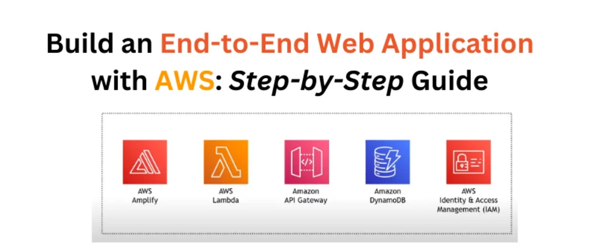

# Build an End-to-End Web Application with AWS, Step-by-Step Guide

Full-Stack Web Application Development with AWS Services
Designed and implemented an end-to-end web application using AWS services including Amplify for hosting, Lambda for serverless computing, DynamoDB for NoSQL database, API Gateway for API management, and IAM for access control. The application allowed users to perform mathematical calculations, store results in a database, and retrieve them later, demonstrating proficiency in architecting serverless applications, integrating multiple AWS services, and implementing secure access controls.

**Discover The Process** of this projects from my website:

[https://akiltipu.com/blog/build-an-end-to-end-web-application-with-aws-step-by-step-guide](https://akiltipu.com/blog/build-an-end-to-end-web-application-with-aws-step-by-step-guide)
